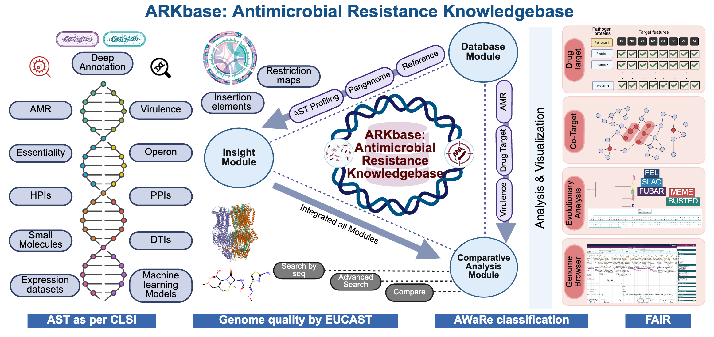

# ARKbase – Antimicrobial Resistance Knowledge Base

---


**ARKbase** is currently hosted at [ARKbase - Antimicrobial Resistance Knowledgebase](https://datascience.imtech.res.in/anshu/arkbase/)

---

ARKbase is an integrated, curated, value-added knowledge-base for AMR, with focus on WHO Bacterial Priority Pathogens. ARKbase is a dedicated AMR resource with a potential to provide novel insights towards expanding the drug-target space.

ARKbase is the largest dedicated resource for WHO bacterial priority pathogens, integrating high-quality genomes, proteomes, AMR genes, and comprehensive datasets including biosynthetic gene clusters, drug targets, antibiotic profiles, gene expression data and machine learning models. This centralized platform assists in understanding resistance mechanisms and supports targeted drug discovery for AMR.

---

## Modules of ARKbase

1. Database Module: Reference and Curated Genome AST
2. Insights Module: Insights module is a composite module and is further divided into following modules as follows: 
	* PanAMR
		* Reference Genome
		* Curated Genome
	* PanVirulence
	* ARG Structure
	* PPI (Protein-Protein Interaction)
	* HPI (Host-Pathogen Interaction)
	* Drug Targets
	* Small Molecule
		* BGC (Biosynthetic Gene Cluster)
		* Known Antibiotics
		* Structure Search
	* DTI (Drug-Target Interaction)
	* Operons
	* Expression Data
	* Machine Learning Models
	* Co-Target
	* Genome Browser
	* Search
		* Search by Sequence
		* Advanced Search
3. Comparative Analysis Module: Comparative sequence analysis for ARGs, Virulence factors and drug targets.

---
## Database Architecture

The backend was built using the LAMP stack, which includes Linux (operating system), Apache (web server), MySQL (database), and PHP (server-side language). The web interface is created with HTML, CSS and JavaScript. ARKBASE runs on a Linux server where Apache (version 2.4.41) handles incoming requests and passes them to PHP (version 7.4.3) scripts and these scripts connect to the MySQL database (version 8.0.26), which stores all the ARKbase data. To make database management easier, phpMyAdmin was used as a graphical interface to organize and maintain the database.
## Repository Structure

This repository is organized into two main directories: `ARKbase source code/` which contains the source for the Database, and `ARKbase Analysis/` which contains the data generation and analysis pipelines for each module.

Below is a visual representation of the repository's layout:

```
.
├── ARKbase source code/
│   └── (All scripts and files for the ARKbase Database)
│
└── ARKbase Analysis/
    ├── Module_Name_1/
    │   ├── Scripts/
    │   └── Readme.md
    │
    ├── Module_Name_2/
    │   ├── Scripts/
    │   └── Readme.md
    │
    └── ... (and so on for each module)
```

### `ARKbase source code/`

This directory houses all the scripts and files used to develop the **ARKbase Database**. It includes the frontend and backend code necessary to run the platform.

### `ARKbase Analysis/`

This directory contains the scripts used to generate the content for each module within ARKbase. Each module-specific sub-directory follows a consistent and self-contained structure:

*   **`{Module Name}/`**: A dedicated folder for each analysis module (e.g., `PanAMR/`, `Drug Targets/`).
    *   **`Scripts/`**: Contains all scripts required to perform the data analysis for the specific module.
    *   **`Readme.md`**: Instructions on how to run the scripts to generate the results.
